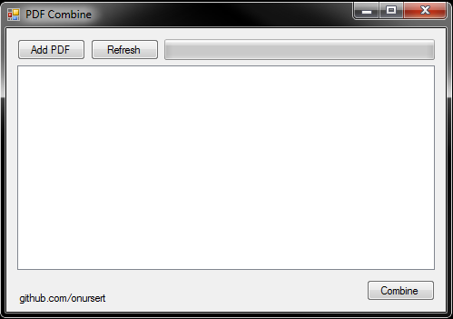

# PDF Combine

PDF Combine (with iText 7) - 2020 (C#)

PDF Combine is a tool for Windows PCs allows you to combine your PDFs.

The interface consists of a small screen. In program you add PDF files, then you can combine PDF easily. This app uses <a href="https://github.com/itext/itext7-dotnet">iText 7</a> for combine process.

PDF Combine app doesn't require installation.

<a href="https://github.com/onursert/PDFCombine/raw/main/PDFCombine.zip">Download PDF Combine</a>
